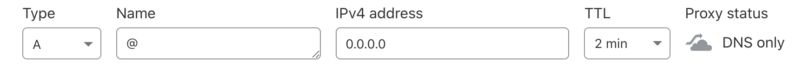

# Cloudflare DDNS

1. Create an `A record` in Cloudflare pointing at your current IP

2. Get your `ZONE_ID` from the `overview` tab for your CF domain. Add it to `.env`

3. Get your `GLOBAL_API_KEY` from the [`/profile/api-tokens`](https://dash.cloudflare.com/profile/api-tokens) section. Add it to `.env`

4. Add the email you use to login to CF to the `AUTH_EMAIL` key in `.env`

5. Add the name of your url or the `ZONE_NAME` to `.env`

To run on a cron:

1. Type `crontab -e` in the terminal

2. `*/30 * * * * node <location of index.js on your machine>` - This runs the node script at 30 minute intervals 

